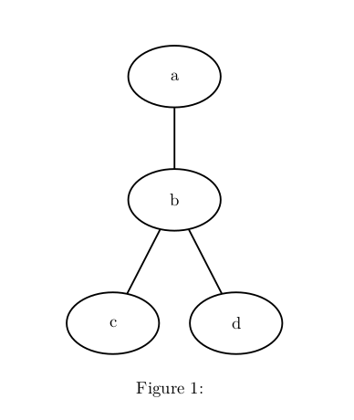
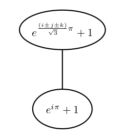

# pandoc-dot2tex-filter

This is a [pandoc](http://pandoc.org/) filter that converts [`dot`](https://en.wikipedia.org/wiki/DOT_%28graph_description_language%29) code into latex-friendly [PGF/TikZ](https://en.wikipedia.org/wiki/PGF/TikZ). It is basically just a wrapper for [`dot2tex` ](https://pypi.python.org/pypi/dot2tex). Because of the nature of the PGF/TikZ format, this filter is only suitable for exporting to `latex` and `pdf`. Rendering to PGF/TikZ gives a better-looking result in pdfs than using a raster image. If you want to convert a document containing `dot` graphs to different formats, check out the `graphviz` filter from the [pandocfilters](https://pypi.python.org/pypi/pandocfilters) package, which renders the graphs to `png`s end embeds them in the output document.

## Requirements

Run:

* `pip install pandocfilters` to install the Python pandocfilters library
* `apt-get install dot2tex`

## Usage

### Running from command line

```
$> pandoc source.md --filter ./path/to/dot2tex-filter.py -H ./path/to/tikz-preamble.latex -t output.pdf
```

**Important!** By default, pandoc's latex template does not include the `tikz` package in the document preamble. To change that, either:

* edit the default template, so it contains this code:
  ```
  \usepackage{tikz}
  ```
* tell pandoc to embed the `tikz-preamble.latex` (included in this repository) in the document's preamble, by adding `-H ./path/to/tikz-preamble.latex` to the `pandoc` command.

### Document examples

In following examples, I'll use Markdown as the source language. 

#### Basic usage

To create a basic graph, create a fenced code block with a `dot` class, like so:

	```dot
	graph graphname{
		a -- b -- c
		b -- d
	}
	```

The result will be:



#### Adding captions

If you want to add a caption, you should use a slightly different syntax:


	```{.dot caption="This is a graph"}
	graph graphname{
		a -- b -- c
		b -- c
	}
	```

The value of the caption can contain any `tex` tokens and it will be properly rendered.

	```{.dot caption="foo bar \alpha \beta"}
	graph graphname{
		a -- b -- c
		b -- c
	}
	```

#### Referencing the graph

The graph will be rendered as a figure. If you want to reference the figure somewhere in your document, you need to give the graph a label, like so:

	```{.dot caption="My graph" label="my_graph"}
	graph graphname{
		a -- b -- c
		b -- c
	}
	```
	
To reference the graph, use

	\ref{my_graph}

directly in paragraph test - it will be properly interpreted by pandoc and rendered as expected.

#### Using math mode within the graph

You can use full math mode inside a node's label. See example:

	```dot
	graph graphname{
		a [texlbl="$\sum_{k=0}^{n-1} e^{2 \pi i k/n}$"];
		b [texlbl="$e^{\frac{(i \pm j \pm k)}{\sqrt 3}\pi} + 1$"];
		a -- b
	}
	```


